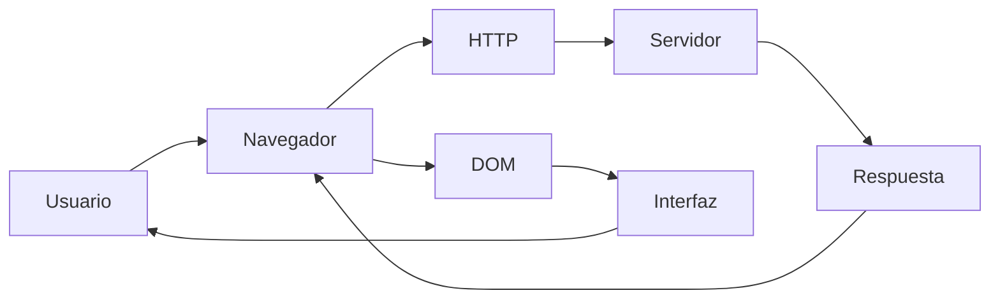
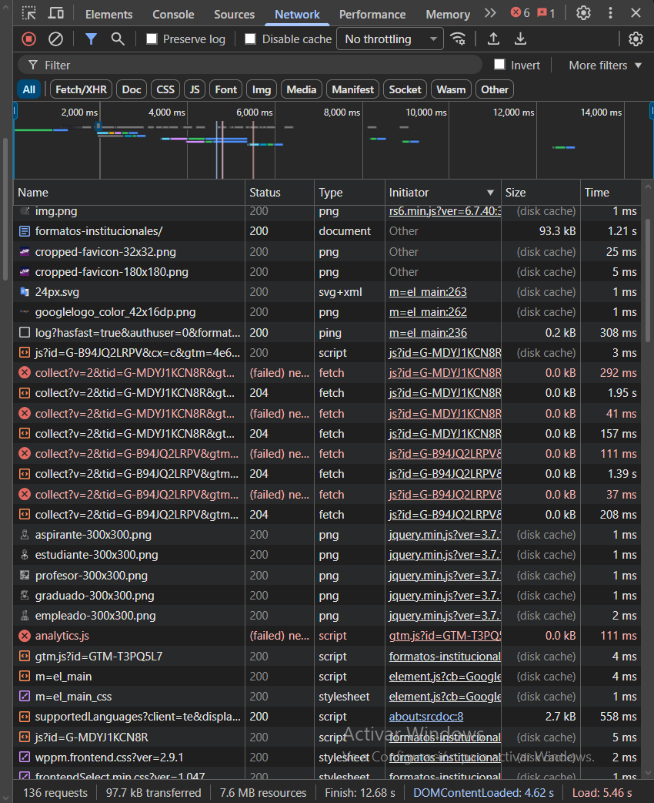
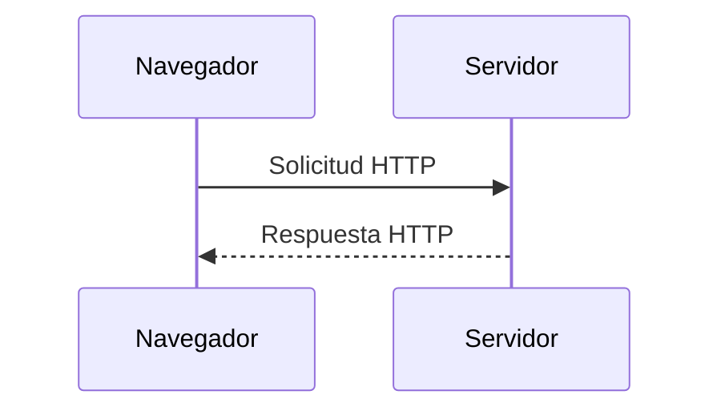
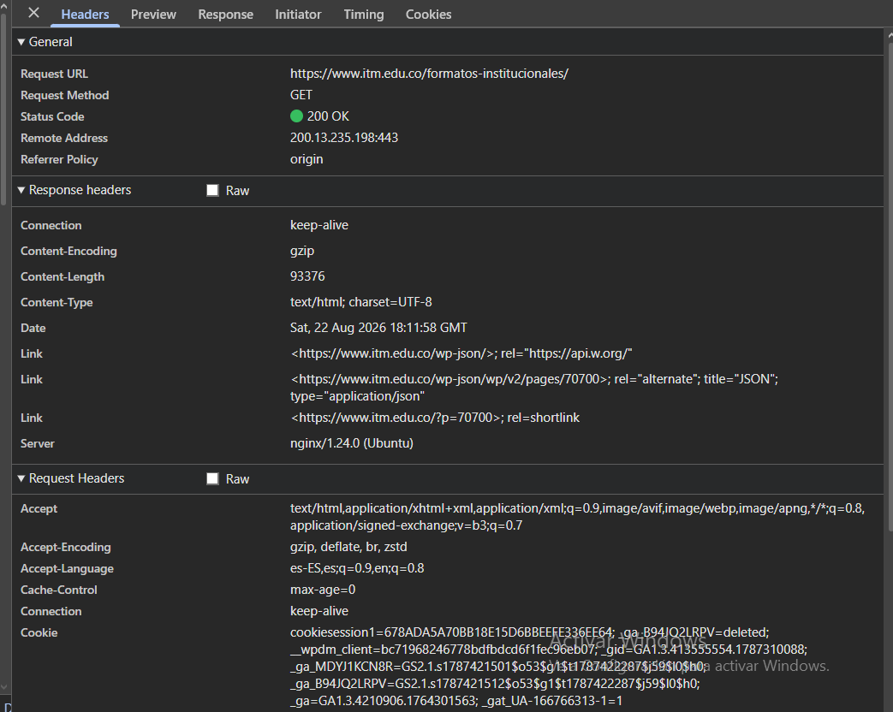
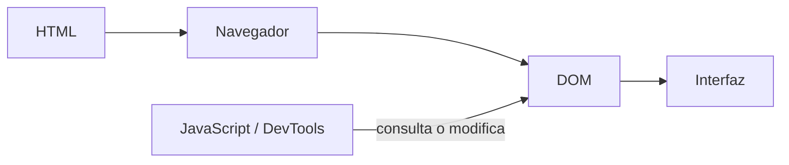
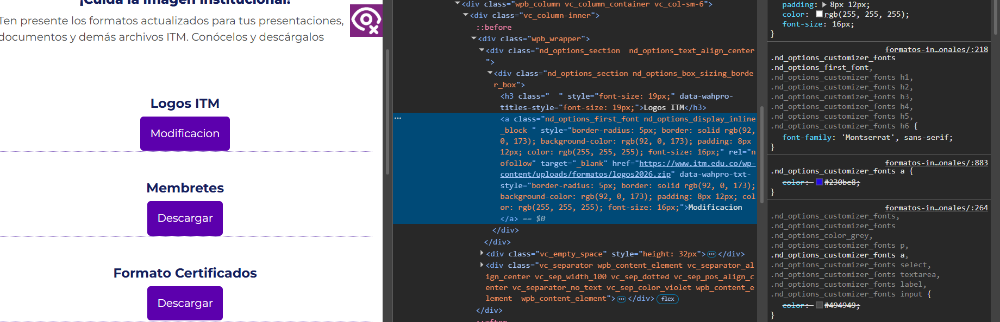
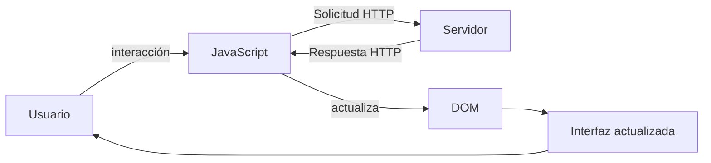
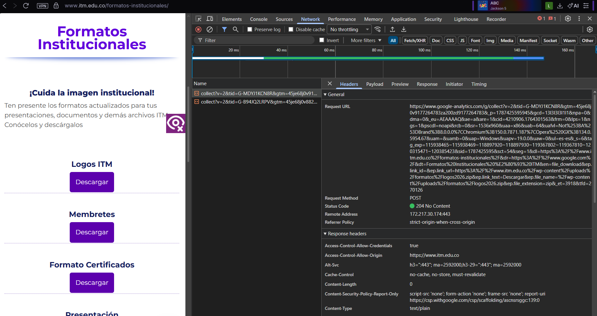
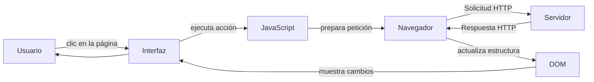

# Laboratorio 01 --- Análisis del funcionamiento de una aplicación web

> **Curso:** Aplicaciones y Servicios Web\
> **Modalidad:** Práctica de laboratorio\
> **Entrega:** Repositorio GitHub --- archivo `README.md`\
> **Evidencias:** Carpeta `evidencias/`

------------------------------------------------------------------------

## Objetivo de la práctica

Analizar el funcionamiento de una aplicación web real mediante las
herramientas de desarrollo del navegador, identificando los recursos
cargados, las solicitudes y respuestas HTTP, la estructura DOM y las
interacciones entre cliente y servidor.

## Resultado esperado

Al finalizar la práctica, el estudiante deberá poder reconstruir y
documentar el flujo observado entre:



> El diagrama anterior representa los **componentes que serán
> analizados**. El diagrama final de la práctica deberá ser construido
> por el estudiante a partir de sus propias observaciones.

------------------------------------------------------------------------

# 1. Preparación del entorno

1.  Ingrese a la aplicación web indicada por el docente.
2.  Abra las **herramientas de desarrollo** del navegador.
3.  Identifique las herramientas **Red / Network** y **Elementos /
    Elements**.
4.  Cree la siguiente estructura dentro del repositorio:

``` text
laboratorio-01/
├── README.md
└── evidencias/
```

El archivo `README.md` será el informe de la práctica. La carpeta
`evidencias/` contendrá las capturas utilizadas para sustentar los
resultados.

------------------------------------------------------------------------

# 2. Identificación de recursos de la aplicación

Abra la herramienta **Red / Network** y recargue completamente la
aplicación.

Observe las solicitudes generadas durante la carga e identifique como
mínimo **cinco recursos**, procurando seleccionar tipos diferentes:
documento HTML, CSS, JavaScript, imágenes, fuentes u otros.

## Resultados

Complete la tabla:
https://www.itm.edu.co/formatos-institucionales/
  Recurso                     Tipo            Dominio              Tamaño
  ---------                  ------          ---------            -------- 
  /u-catedras.png        |     png     |      itm.edu.co    |     (disk cache) <br>  
/formatos-institucionales/ |  Document  |       itm.edu.co   |        93.3 kB    <br>                   
/gtm.js?id=GTM-T3PQ5L7   |    Script   |  googletagmanager.com  |  (disk cache)  <br>

/m=el_main_css        |      Stylesheet    |    gstatic.com   |    (disk cache)  <br>

/01-Programas.gif     |        Gif        |     itm.edu.co    |    (disk cache)  <br>
                                        

**Total de solicitudes observadas:** `136`

## Evidencia

Guarde una captura de la pestaña Network como:

``` text
evidencias/network.png
```

Inclúyala aquí:

markdown



### Análisis

**¿Por qué una sola URL puede generar múltiples solicitudes HTTP?**

> Escriba aquí su respuesta.

Una sola URL genera múltiples solicitudes HTTP porque la página web principal necesita descargar archivos extras como: imágenes, estilos, códigos, etc, esto con el fin de que la pagina se vea completa.

# 3. Análisis de una solicitud HTTP

En **Network**, seleccione una de las solicitudes realizadas por el
navegador, preferiblemente la correspondiente al documento principal.

Identifique la información solicitada a continuación.

  Elemento              Resultado
  --------------------- -----------
  URL: https://www.itm.edu.co/formatos-institucionales/   <br>                 
  Método HTTP: GET <br>          
  Código de estado: 200 OK  <br>   
  Host / dominio:  www.itm.edu.co    <br>  
  Tipo de recurso:  text/html  <br>     
  Tiempo de respuesta: 768.59 ms <br>  

## Flujo que se está observando



## Evidencia

Guarde una captura de los detalles de la solicitud como:

``` text
evidencias/request.png
```

Inclúyala en el informe:

markdown



### Análisis

**¿Qué recurso solicitó el navegador?**

> Escriba aquí su respuesta: Solicitó el documento HTML correspondiente a la página web institucional "/formatos-institucionales/"

**¿Qué información permite determinar si la solicitud fue atendida
correctamente?**

> Escriba aquí su respuesta: El código de estado HTTP 200 OK indica que la solicitud fue procesada con éxito por el servidor y que entregó el contenido solicitado.


# 4. Inspección del DOM

Seleccione un elemento visible de la aplicación, por ejemplo:

-   un botón;
-   un título;
-   un enlace;
-   un campo de formulario;
-   un elemento del menú.

Utilizando **Elementos / Elements**:

1.  Localice el elemento dentro del DOM.
2.  Identifique la etiqueta HTML utilizada.
3.  Modifique temporalmente su contenido desde las herramientas de
    desarrollo.
4.  Observe el cambio producido en la interfaz.
5.  Registre la evidencia.

## Resultados

**Elemento seleccionado:** `El boton descargar que esta debajo del texto 'Logos ITM'`  <br>

**Etiqueta HTML:** `<a>`  <br>

**Contenido original:** `Descargar`  <br>

**Modificación realizada:** `Se edito el texto que decía 'Descargar' por el texto 'Modificacion'`  <br>

El proceso observado puede representarse conceptualmente así:



## Evidencia

Guarde la captura como:

``` text
evidencias/dom.png
```

Inclúyala aquí:

markdown



### Análisis

**¿La modificación realizada sobre el DOM alteró permanentemente la
aplicación o los archivos almacenados en el servidor? Justifique.**

> Escriba aquí su respuesta: No, la modificacion realizada no es permanente, lo que se esta modificando es una copia del DOM que el servidor nos envia a nuestro navegador, esta modificación solo se guarda temporalmente en nuestro cliente local y no tiene ninguna repercusión en el DOM real del servidor.

# 5. Análisis de una interacción dinámica

Regrese a **Network** y limpie las solicitudes registradas.

Realice una acción dentro de la aplicación que pueda generar una
interacción con el servidor, por ejemplo:

-   consultar;
-   buscar;
-   filtrar;
-   seleccionar una opción;
-   enviar información.

Observe si aparece una nueva solicitud en Network.

## Resultados

  Elemento                       Resultado
  ------------------------------ -----------
  Acción realizada: Le dia al boton descargar debajo del titulo Logos ITM  <br>        
  ¿Generó una nueva solicitud?:   Si, genero 2 nuevas respuestas  <br>
  URL solicitada: https://www.google-analytics.com/g/collect?v=2&tid=G-  <br>MDYJ1KCN8R&gtm=...  <br>                
  Método HTTP: POST  <br>                  
  Código de estado: 204 No Content   <br>            
  Tipo de respuesta: text/plain   <br>           

## Ciclo de interacción

Utilice este esquema únicamente como referencia conceptual para
interpretar lo observado:



## Evidencia

Guarde la captura como:

``` text
evidencias/interaccion.png
```

Inclúyala aquí:

markdown



### Análisis

**Explique la relación entre la acción realizada por el usuario y la
solicitud observada.**

> Escriba aquí su respuesta: Básicamente, cuando hacemos clic en un botón o interactuamos con la página, el navegador no tiene esa información que estamos solicitando ahi guardada, así que se genera una solicitud HTTP para pedírsela al servidor. La petición que vemos en Network es simplemente el navegador procesando y enviando esa orden que acabamos de dar en la pantalla.

# 6. Reconstrucción del flujo observado

A partir de **sus propias evidencias**, construya un diagrama Mermaid
que represente el funcionamiento de la aplicación analizada.

El diagrama deberá incluir, cuando corresponda:

`Usuario` · `Navegador` · `JavaScript` · `Solicitud HTTP` · `Servidor` ·
`Respuesta HTTP` · `DOM` · `Interfaz`

> **No copie los diagramas anteriores.** Esta sección debe representar
> el flujo que usted pudo comprobar durante la práctica.

Reemplace el siguiente bloque con su diagrama:



------------------------------------------------------------------------

# 7. Observado vs. inferido

Una herramienta de desarrollo permite observar una parte del sistema,
pero no necesariamente todo lo que ocurre en el servidor.

Clasifique sus hallazgos:

## Elementos observados directamente

Las solicitudes HTTP con su URL, el método GET y el código de estado 200 OK en la pestaña Network.

La estructura de la página en la pestaña Elements y cómo cambia el texto en la pantalla al editarlo.

Los tiempos de carga de la petición se encuentran en la pestaña Timing.

## Elementos inferidos

El funcionamiento interno del servidor donde está alojada la página web.
Lo que hace el servidor por dentro para procesar la página y buscar los archivos. 
Las bases de datos que utiliza la universidad para guardar la información. 

> No presente como observado un proceso interno que las herramientas del
> navegador no permitan comprobar directamente.

------------------------------------------------------------------------

# 8. Conclusiones

Redacte **tres conclusiones técnicas** derivadas de la práctica.

1.  Sobre la modificación del DOM: Comprobamos que editar el código desde la pestaña Elements solo afecta nuestro cliente local. La evidencia de esto es que al darle recargar a la página, todo vuelve a su estado original, lo que prueba que el navegador solo recibe una copia temporal y que el servidor mantiene los archivos intactos.
2. Sobre el flujo en Network: Con la prueba del botón de descarga pudimos ver en la pestaña Network cómo cada clic genera una Solicitud HTTP. Esto demuestra que la interfaz no funciona sola, sino que depende totalmente de las respuestas en texto o archivos que nos envía el servidor. 
3. Sobre la diferencia entre lo visto y lo inferido: Aprendimos que el inspeccionamiento de elementos solo nos muestra la capa del cliente, pero no lo que pasa dentro del servidor. Esto significa que a través del navegador podemos hacer cambios en la estructura visual, pero el procesamiento interno sigue siendo invisible para nosotros.

Las conclusiones deben explicar lo aprendido a partir de la evidencia y
no limitarse a describir las actividades realizadas.

------------------------------------------------------------------------

# 9. Entrega

La estructura final esperada es:

``` text
laboratorio-01/
├── README.md
└── evidencias/
    ├── network.png
    ├── request.png
    ├── dom.png
    └── interaccion.png
```

Antes de entregar, verifique:

-   [ ] El `README.md` se visualiza correctamente en GitHub.
-   [ ] Las imágenes se muestran dentro del README.
-   [ ] Se documentaron al menos cinco recursos.
-   [ ] Se analizó una solicitud HTTP.
-   [ ] Se identificó y modificó un elemento del DOM.
-   [ ] Se analizó una interacción de la aplicación.
-   [ ] El diagrama final corresponde a lo observado.
-   [ ] Se diferenciaron elementos observados e inferidos.
-   [ ] Se redactaron tres conclusiones técnicas.
-   [ ] Se realizó `commit` y `push` al repositorio.

------------------------------------------------------------------------

## Criterio de documentación

> **Las capturas son evidencia, no la respuesta.**

Cada evidencia debe estar acompañada por una explicación que indique
**qué se observó, qué significa y cómo se relaciona con el
funcionamiento de la aplicación web**.
